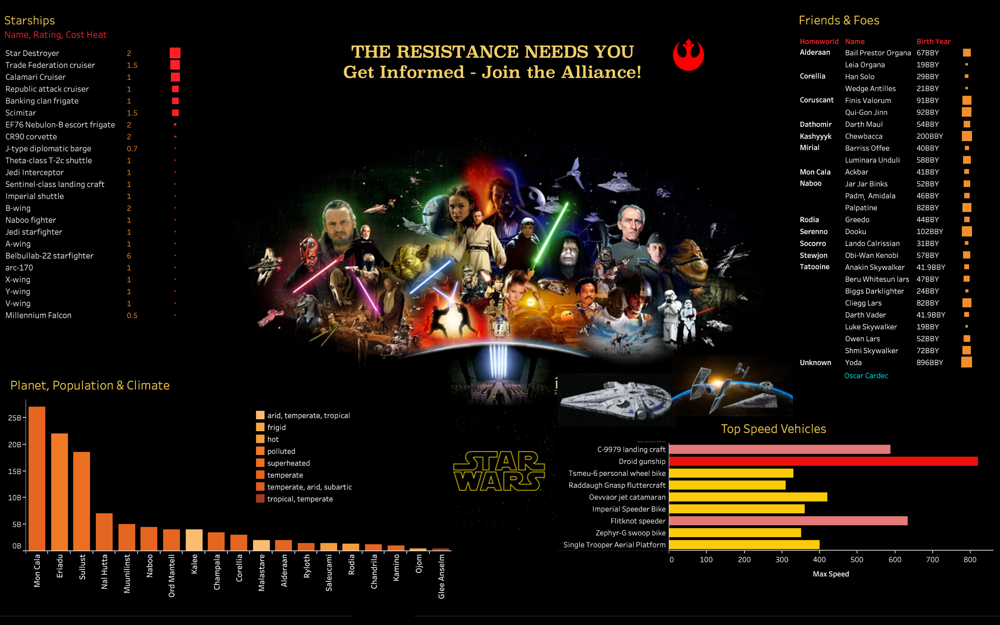

 
 

## Oscar Cardec, MS  === In Construction ===

#### Data Scientist  

---

---

- Lead Data Scientist)

- Veteran, Intelligence Analyst \- U.S. Air Force

- Active Security Clearance

---

---

#### [Resources List]()

---

  

Provided consulting work to the CEO of a Private Equity backed dental practice.  Deliverables included a deployed patient churn prediction model and a prioritized patient re-contact list (based on customer segmentation). Deliverables are embedded into staff daily workflow and provide an estimated savings of $30K per year for the practice.

  

#### [Reports List]()

---

  

Built an analytics platform for the CEO of non-profit veteran's service organization. Project involved entirety of Data Lifecycle, from data acquistion/ingestion all the way through providing self-serve analytics at the end user's fingertips. Built on the Python Dash framework.

  

#### [Books List]()

---

  

Conducted rigorous analysis of the SOF Veteran community as represented by a partner 503c non-profit veteran service organization. Provide CEO and staff with information allowing them to make decisions to improve offerings to veterans, change marketing strategies, and allocate resources effectively.

  

#### [Podcasts List]()

---

  

An analysis of Vietnam War deaths over the entirety of the period of US involvement from 1956 - 1975.  Project analysis includes interactive timeline, highlights of interest, and a comprehensive demographic breakdown of the casualties.

 
 
 
 
