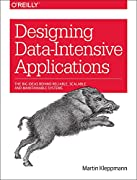
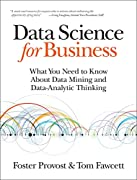
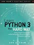
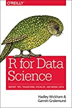

---
title: "My Recommended Books"
author: "by OC"
knit: (function(input_file, encoding) {
  out_dir <- '../html';
  rmarkdown::render(input_file,
 encoding=encoding,
 output_file=file.path(dirname(input_file), out_dir, 'books.html'))})
output: html_document
--- 
  

   

>“Our job is obvious: We need to get out of the way, shine a light, and empower a new generation to teach itself and to go further and faster than any generation ever has.” ―Seth Godin

   

| | | | | |
|-|-|-|-|-|
| {width="75"} | [Applied Predictive Modeling by Kuhn, Max, & Johnson, Kjell](https://a.co/d/h9QYjJs) | | {width="75"} | [Designing Data-Intensive Applications: The Big Ideas Behind Reliable, Scalable, and Maintainable Systems by Martin Kleppmann](https://a.co/d/7kuGvhK) |
| {width="75"} | [Practical Simulations for Machine Learning: Using Synthetic Data for AI by by Paris Buttfield-Addison, Mars Buttfield-Addison, Tim Nugent, & Jon Manning](https://a.co/d/cKSBViY) | | {width="75"} | [Advanced R, Second Edition (Chapman & Hall/CRC The R Series) by Hadley Wickham](https://a.co/d/9yn5Fee) |
| {width="75"} | [Deep Learning (Adaptive Computation and Machine Learning Series) by Ian Goodfellow, Yoshua Bengio, & Aaron Courville](https://a.co/d/dZI32PP) | | {width="75"} | [Data Engineering with Python: Work with massive datasets to design data models and automate data pipelines using Python by Paul Crickard](https://a.co/d/d9HHPCt) |
{width="75"} | [Practical Statistics for Data Science: 50 Essential Concepts by Peter Bruce, & Andrew Bruce](https://a.co/d/7Ce9wfr) | | {width="75"} | [An Introduction to Statistical Learning: with Applications in R by Gareth James, Daniela Witten, Trevor Hastie, & Robert Tibshirani](https://a.co/d/82EsyQz) |
| {width="75"} | [The Hundred-Page Machine Learning Book by Andriy Burkov](https://a.co/d/c6goxBT) | | {width="75"} | [Machine Learning Engineering by Andriy Burkov](https://a.co/d/jldHS9g) |
| {width="75"} | [Data Science from Scratch: First Principles with Python by Joel Grus](https://a.co/d/cR0hMEs) | | {width="75"} | [Hands-On Machine Learning with Scikit-Learn, Keras, and TensorFlow: Concepts, Tools, and Techniques to Build Intelligent Systems](https://a.co/d/2wb1qWd) |
| {width="75"} | [Data Science Projects with Python: A case study approach to gaining valuable insights from real data with machine learning, 2nd Edition by Stephen Klosterman](https://a.co/d/i2AWZdU) | | {width="75"} | [The Art of R Programming: A Tour of Statistical Software Design by Norman Matloft](https://a.co/d/iWo4XCd) |
| {width="75"} | [Data Science for Business: What You Need to Know about Data Mining and Data-Analytic Thinking by Foster Provost \& Tom Fawcett](https://a.co/d/3VUqn3u) | | {width="75"} | [Applied Predictive Analytics: Principles and Techniques for the Professional Data Analyst by Dean Abbott](https://a.co/d/ffpC6JJ) |
| {width="75"} | [A General Introduction to Data Analytics by João Moreira, Andre Carvalho, & Tomás Horvath](https://a.co/d/0lFSc5u) | | {width="75"} | [Data Science and Big Data Analytics: Discovering, Analyzing, Visualizing, and Presenting Data by EMC Education Services](https://a.co/d/i78mgOA) |
| {width="75"} | [Decision Management Systems: A Practical Guide to Using Business Rules and Predictive Analytics by James Taylor](https://a.co/d/5lyJjgZ) | | {width="75"} | [Systems Analysis and Design Shelly Cashman by Scott Tilley & Harry Rosenblatt](https://a.co/d/b5YH1WI) | 
| {width="75"} | [Storytelling with Data: A Data Visualization Guide for Business Professionals by Cole Nussbaumer Knaflic](https://a.co/d/03JQgx4) | | {width="75"} | [Learn Python 3 the Hard Way: A Very Simple Introduction to the Terrifying Beautiful World of Computer and Code by Zed Shaw](https://a.co/d/88YZsaD) | 
| {width="75"} | [Python for Data Analysis: Data Wrangling with Pandas, Numpy, and IPython by William McKinney](https://a.co/d/8zGyPe8) | | {width="75"} | [R For Data Science: Import, Tidy, Transform, Visualize, and Model Data by Garrett Grolemund & Hadley Wickham](https://a.co/d/0DoFNnf) |

   

>\“There is divine beauty in learning…. To learn means to accept the postulate that life did not begin at my birth. Others have been here before me, and I walk in their footsteps.\” \―Elie Wiesel

      

---  

[Home Page](index.html)