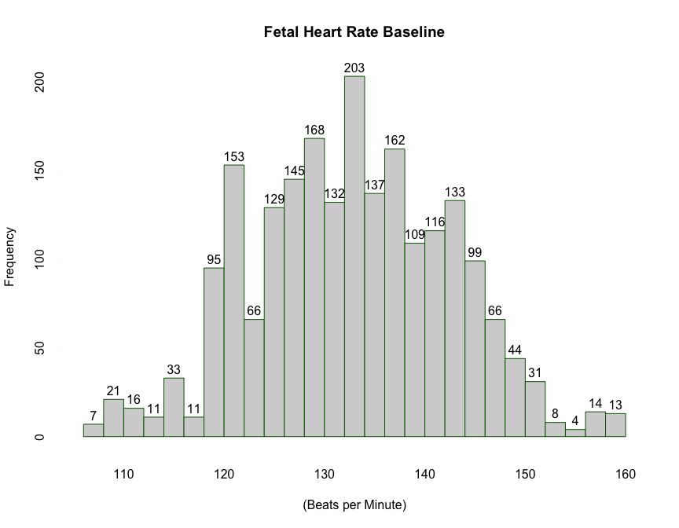
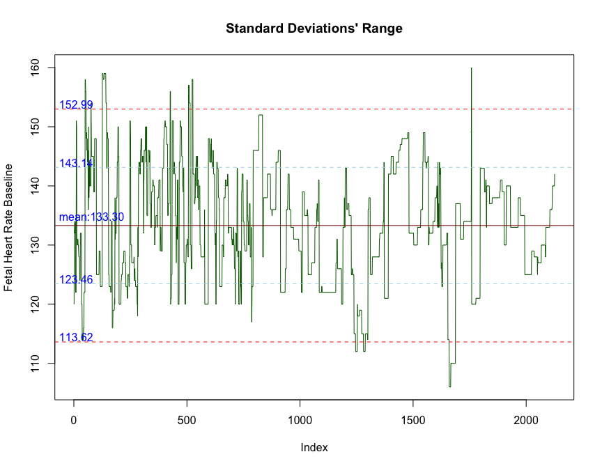
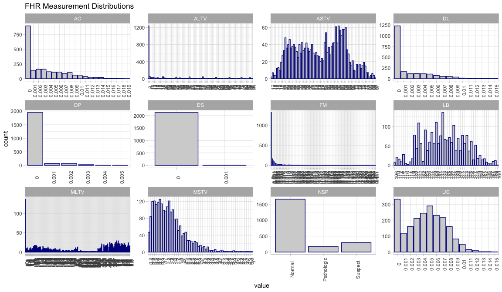
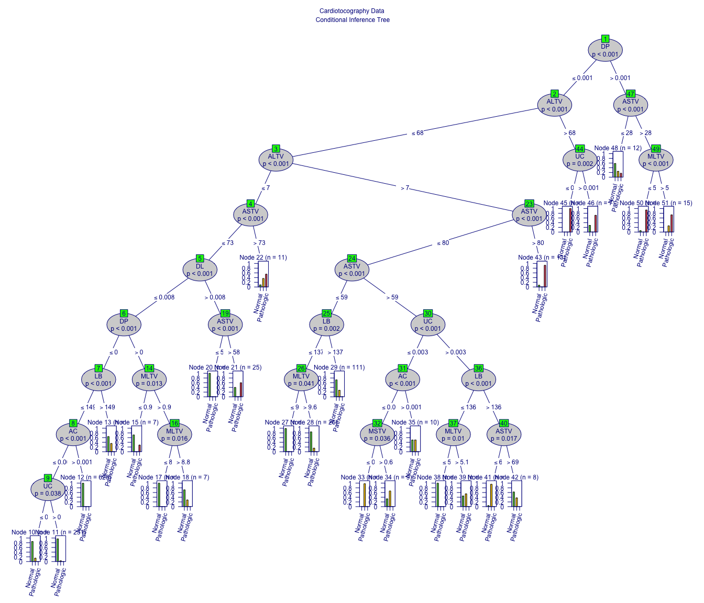
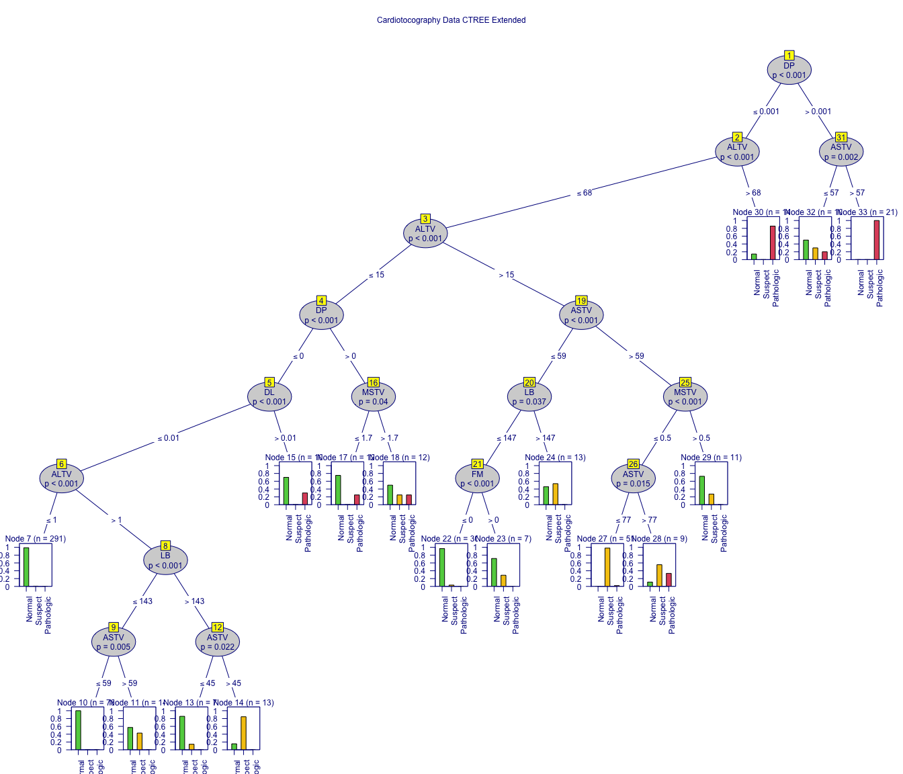

---
title: "Cardiotocograms Classification with CTREE in RStudio"
author: "by OC"
date: "Oct 2020"
output:
  html_document: 
    df_print: default
    fig_caption: yes
    fig_height: 7
    fig_width: 9
    highlight: espresso
    theme: sandstone
    toc: yes
    keep_md: yes
  pdf_document: no
  html_notebook: 
    number_sections: yes
height: 1800
width: 2800
editor_options: 
  chunk_output_type: console
--- 


### Preface   

Cardiotocograms, also known as CTGs, have been instrumental within clinical medicine for a long time. Obstetricians use these measurements and classifications to obtain detailed information and intelligence about newborns and their mothers prior to and during labor. In 2018, an article presented through the Journal of Clinical Medicine detailed the practicality of CTGs. The same noted that interpretations of these censorial readings are mainly attributed to the observer; which creates challenges of consistency of interpretations and defies the human naked eye. Questions like what happens, if or when, the interpreter misses a key detail? Furthermore, what time-sensitive conditions may the measurements uncover, requiring immediate actions are few examples of concerns posed by the continuous practice of merely optical assessments of a CTG [5](References.html).     

The following report presents an assessment of CTGs using the conditional inference tree (ctree) model within RStudio. The same shows how the algorithm expedites and enhances the interpretation of CTG readings while appraising multiple fetal readings simultaneously. Moreover, the study aims to identify potentially hidden patterns that may require further attention. 

<br/>

### Collection 

The data-frame to be analyzed comes from the UCI Machine Learning Repository, and it consists of measurements of fetal heart rate (FHR) and uterine contraction (UC) as identified and recorded by cardiotocograms. It contains 2126 observations and 23 variables. Each diagnostic attribute within these CTGs was automatically processed and measured. Finally, for supervised learning purposes, all CTGs were classified by three subject matter experts, and under unanimity, assigned them with response-labels based on the fetal state and/or morphological detected patterns [3](References.html).

##### Data Dictionary

- LB: FHR baseline (beats per minute)                               
- AC: Number of accelerations per second 
- FM: Number of fetal movements per second 
- UC: Number of uterine contractions per second 
- DL: Number of light decelerations per second 
- DS: Number of severe decelerations per second 
- DP: Number of prolonged decelerations per second 
- ASTV: Percentage of time with abnormal short-term variability 
- MSTV: Mean value of short term variability 
- ALTV: Percentage of time with abnormal long-term variability 
- MLTV: Mean value of long -erm variability 
- Width: Width of FHR histogram 
- Min: Minimum of FHR histogram 
- Max: Maximum of FHR histogram 
- Nmax: Number of histogram peaks 
- Nzeros: Number of histogram zeros 
- Mode: Histogram mode 
- Mean - Histogram mean 
- Median - Histogram median 
- Variance - Histogram variance 
- Tendency - Histogram tendency 
- CLASS - FHR pattern class code (1 to 10) 
- NSP - Fetal state class code (N = Normal; S = Suspect; P = Pathologic)

As observed, the above list includes unique CTG measurements, statistical attributes as well as observations from some of the recorded variables.  The last two variables, CLASS and NSP, represent the previously mentioned classification and response-labeling conducted by the obstetricians.    

<br/>

### Exploratory Analysis

The given cardiotocography.csv file was loaded and vectored as ctg. A look into the structure of the data-frame confirms some of the variables and information obtained from the repository and .csv file itself. The 2126 observations are a mix of formatted integers and numeric values. A glimpse over these represented values highlights few transformation options. Case in point, the targeted variable, which is the NSP, will need to get converted to a factor. Other variables like FM, DP, or ALTV may be representative of asymmetrical distributions. Furthermore, a variable like DS appears to have only one type of response, making it incomparable for classification purposes.  


```
##        LB              AC                 FM                 UC          
##  Min.   :106.0   Min.   :0.000000   Min.   :0.000000   Min.   :0.000000  
##  1st Qu.:126.0   1st Qu.:0.000000   1st Qu.:0.000000   1st Qu.:0.002000  
##  Median :133.0   Median :0.002000   Median :0.000000   Median :0.004000  
##  Mean   :133.3   Mean   :0.003178   Mean   :0.009481   Mean   :0.004366  
##  3rd Qu.:140.0   3rd Qu.:0.006000   3rd Qu.:0.003000   3rd Qu.:0.007000  
##  Max.   :160.0   Max.   :0.019000   Max.   :0.481000   Max.   :0.015000  
##        DL                 DS                  DP                 ASTV      
##  Min.   :0.000000   Min.   :0.000e+00   Min.   :0.0000000   Min.   :12.00  
##  1st Qu.:0.000000   1st Qu.:0.000e+00   1st Qu.:0.0000000   1st Qu.:32.00  
##  Median :0.000000   Median :0.000e+00   Median :0.0000000   Median :49.00  
##  Mean   :0.001889   Mean   :3.293e-06   Mean   :0.0001585   Mean   :46.99  
##  3rd Qu.:0.003000   3rd Qu.:0.000e+00   3rd Qu.:0.0000000   3rd Qu.:61.00  
##  Max.   :0.015000   Max.   :1.000e-03   Max.   :0.0050000   Max.   :87.00  
##       MSTV            ALTV             MLTV            Width       
##  Min.   :0.200   Min.   : 0.000   Min.   : 0.000   Min.   :  3.00  
##  1st Qu.:0.700   1st Qu.: 0.000   1st Qu.: 4.600   1st Qu.: 37.00  
##  Median :1.200   Median : 0.000   Median : 7.400   Median : 67.50  
##  Mean   :1.333   Mean   : 9.847   Mean   : 8.188   Mean   : 70.45  
##  3rd Qu.:1.700   3rd Qu.:11.000   3rd Qu.:10.800   3rd Qu.:100.00  
##  Max.   :7.000   Max.   :91.000   Max.   :50.700   Max.   :180.00  
##       Min              Max           Nmax            Nzeros       
##  Min.   : 50.00   Min.   :122   Min.   : 0.000   Min.   : 0.0000  
##  1st Qu.: 67.00   1st Qu.:152   1st Qu.: 2.000   1st Qu.: 0.0000  
##  Median : 93.00   Median :162   Median : 3.000   Median : 0.0000  
##  Mean   : 93.58   Mean   :164   Mean   : 4.068   Mean   : 0.3236  
##  3rd Qu.:120.00   3rd Qu.:174   3rd Qu.: 6.000   3rd Qu.: 0.0000  
##  Max.   :159.00   Max.   :238   Max.   :18.000   Max.   :10.0000  
##       Mode            Mean           Median         Variance     
##  Min.   : 60.0   Min.   : 73.0   Min.   : 77.0   Min.   :  0.00  
##  1st Qu.:129.0   1st Qu.:125.0   1st Qu.:129.0   1st Qu.:  2.00  
##  Median :139.0   Median :136.0   Median :139.0   Median :  7.00  
##  Mean   :137.5   Mean   :134.6   Mean   :138.1   Mean   : 18.81  
##  3rd Qu.:148.0   3rd Qu.:145.0   3rd Qu.:148.0   3rd Qu.: 24.00  
##  Max.   :187.0   Max.   :182.0   Max.   :186.0   Max.   :269.00  
##     Tendency           CLASS            NSP       
##  Min.   :-1.0000   Min.   : 1.00   Min.   :1.000  
##  1st Qu.: 0.0000   1st Qu.: 2.00   1st Qu.:1.000  
##  Median : 0.0000   Median : 4.00   Median :1.000  
##  Mean   : 0.3203   Mean   : 4.51   Mean   :1.304  
##  3rd Qu.: 1.0000   3rd Qu.: 7.00   3rd Qu.:1.000  
##  Max.   : 1.0000   Max.   :10.00   Max.   :3.000
```

_Figure 1.1 – NSP, as the response variable, will be converted to a factor_ 

<br/>

The above illustration expands and corroborates other aspects within the data. Case in point, judging by the numbers, Width, Min, Max, Nmax, Nzeros, Mode, Mean, Median, Variance, and Tendency appear to be statistical results of a measurement. Also, the variance across distributions is evident, thus, extra steps will have to be taken during the pre-processing phase. Lastly, there are no NA values within the set.  

After reviewing the statistical attributes of the data set, a histogram was built to represent the LB variable.  Per the data dictionary, this particular attribute is the most influential attribute of the set. The image in figure 1.2 shows how equally distributed the LB attribute is, and by the featured frequency, the mean will most likely fall between 130-135 heart-beats per minute.  

<!-- -->

_Figure 1.2 – Fetal heart hate baseline (LB variable) is fairly distributed._ 

<br/>

Motivated by the variability of the baseline distribution, a deeper look was taken to identify out of the represented observations which ones were outside the 2-Standard Deviation (S.D.) ranges.  Figure 1.3, portrays what the developed code captured. It shows the values associated with the S.D.s’ boundaries, and how some of the readings exceed such boundaries.


  
<!-- -->

_Figure 1.3 – Graphical display of LB’s 1 & 2 Standard Deviations._ 

<br/>

After further calculation, like the one below, shows how critical this reading resulted, given that those readings within 2-S.D. account for over 96% of the studied observations. That said, this does not imply the contained readings are one way or the other (Normal, Suspect, or Pathologic), but instead shows the usability of these quantified observations.


```r
lba <- (sum(ctg$LB > 152.99)) # LB Observations higher than 2-s.d. # 39
lbb <- (sum(ctg$LB < 113.62)) # LB Observations lower than 2-s.d. # 44
lba + lbb  # 83 obs outside of the 2-s.d. boundaries
```

```
## [1] 83
```

```r
rate_in <- sum(between(ctg$LB, 113.62, 152.99)/nrow(ctg)) # of obs within 2-s.d.
valx <- (sum(round(rate_in * 100, 2)))
valx
```

```
## [1] 96.1
```

<br/>

Considering the findings through the EDA process, and explanatory details from the data source, the variables that were not part of the original collection were excluded. After further inquiry, these characteristics and calculations were related to the FHR baseline histogram made by the analytical software used by the dataset originators [5](References.html). Initially, the CLASS variable was converted to a factor and all of its 10 levels renamed. Unfortunately, this variable also resulted to be a classification conducted by the medical practitioners, and contributed to the over-fitting of the model, thus forcing to reassess the development approach. That said, the CLASS variable was used as a guide for interpretation, but not included on the final set of variables to test within the model. Besides, the NSP variable was transformed into a factor, and its levels were renamed to normal, suspect, and pathologic. Figure 1.4 gives a brief look of some of the variables and their respective distribution characteristics. 


```r
# Distributions preview
ctg[,1:12] %>% 
  gather() %>%                             
  ggplot(aes(value)) +
  theme_light() + labs(title = "FHR Measurement Distributions") +
  theme(axis.text.x = element_text(angle=90)) +                 
  facet_wrap(~ key, scales = "free", shrink = TRUE) +  
  geom_bar(mapping = aes(value), 
           color = "darkblue", fill = "lightgrey")
```

```
## Warning: attributes are not identical across measure variables; they will be
## dropped
```

<!-- -->
_Figure 1.4 – Dataset transformed._

Click [HERE](images/final_distributions.png) for an amplified view of Figure 1.4

<br/>

### Algorithm Intuition

As previously stated, the conditional inference tree (ctree) algorithm is used for this dataset classification. The objective is to use the model for the identification of those independent variables with the greatest influence against the response variable.  Author, Torsten Hothorn, summarizes the algorithm behind the ctree as follow: “A conditional inference trees estimate a regression relationship by binary recursive partitioning in a conditional inference framework [4](References.html). Hothorn explains that first “the algorithm tests the sample for a hypothesis of independence between the independent variables and the response”.  If the hypothesis cannot be rejected the process stops. Conversely, it selects the variable with the strongest measured association (measured by the corresponding p-value). Secondly, it implements a binary decision and split in the selected variable, and recursively continues this process until all observations get evaluated [4](References.html).
The first step in developing the model was setting a seed (to replicate the results) and splitting the dataset into different samples to train and test the model. After numerous evaluations, comparison of different simulations, and accuracy appraisals, the data splitting proportions were set to 0.70 and 0.30, for the training and testing subsets, respectively. 


```r
# Creating the training and testing data subsets
set.seed(1234)
ind <- sample(2, nrow(ctg), replace = TRUE, prob = c(0.70, 0.30))
train.data <- ctg[ind == 1, ]
test.data <- ctg[ind == 2, ]

# Runing the method against the train data subset
myFormula <- NSP~.
model <- ctree(myFormula, data = train.data)
print(model)
```

```
## 
## Model formula:
## NSP ~ LB + AC + FM + UC + DL + DS + DP + ASTV + MSTV + ALTV + 
##     MLTV
## 
## Fitted party:
## [1] root
## |   [2] DP <= 0.001
## |   |   [3] ALTV <= 68
## |   |   |   [4] ALTV <= 7
## |   |   |   |   [5] ASTV <= 73
## |   |   |   |   |   [6] DL <= 0.008
## |   |   |   |   |   |   [7] DP <= 0
## |   |   |   |   |   |   |   [8] LB <= 149
## |   |   |   |   |   |   |   |   [9] AC <= 0.001
## |   |   |   |   |   |   |   |   |   [10] UC <= 0: Normal (n = 34, err = 14.7%)
## |   |   |   |   |   |   |   |   |   [11] UC > 0: Normal (n = 231, err = 3.5%)
## |   |   |   |   |   |   |   |   [12] AC > 0.001: Normal (n = 626, err = 0.3%)
## |   |   |   |   |   |   |   [13] LB > 149: Normal (n = 17, err = 35.3%)
## |   |   |   |   |   |   [14] DP > 0
## |   |   |   |   |   |   |   [15] MLTV <= 0.9: Normal (n = 7, err = 28.6%)
## |   |   |   |   |   |   |   [16] MLTV > 0.9
## |   |   |   |   |   |   |   |   [17] MLTV <= 8.8: Normal (n = 28, err = 0.0%)
## |   |   |   |   |   |   |   |   [18] MLTV > 8.8: Normal (n = 7, err = 28.6%)
## |   |   |   |   |   [19] DL > 0.008
## |   |   |   |   |   |   [20] ASTV <= 58: Normal (n = 35, err = 0.0%)
## |   |   |   |   |   |   [21] ASTV > 58: Pathologic (n = 25, err = 40.0%)
## |   |   |   |   [22] ASTV > 73: Pathologic (n = 11, err = 45.5%)
## |   |   |   [23] ALTV > 7
## |   |   |   |   [24] ASTV <= 80
## |   |   |   |   |   [25] ASTV <= 59
## |   |   |   |   |   |   [26] LB <= 137
## |   |   |   |   |   |   |   [27] MLTV <= 9.6: Normal (n = 72, err = 1.4%)
## |   |   |   |   |   |   |   [28] MLTV > 9.6: Normal (n = 26, err = 15.4%)
## |   |   |   |   |   |   [29] LB > 137: Normal (n = 111, err = 27.9%)
## |   |   |   |   |   [30] ASTV > 59
## |   |   |   |   |   |   [31] UC <= 0.003
## |   |   |   |   |   |   |   [32] AC <= 0.001
## |   |   |   |   |   |   |   |   [33] MSTV <= 0.6: Suspect (n = 92, err = 2.2%)
## |   |   |   |   |   |   |   |   [34] MSTV > 0.6: Suspect (n = 9, err = 33.3%)
## |   |   |   |   |   |   |   [35] AC > 0.001: Normal (n = 10, err = 50.0%)
## |   |   |   |   |   |   [36] UC > 0.003
## |   |   |   |   |   |   |   [37] LB <= 136
## |   |   |   |   |   |   |   |   [38] MLTV <= 5.1: Normal (n = 18, err = 0.0%)
## |   |   |   |   |   |   |   |   [39] MLTV > 5.1: Suspect (n = 11, err = 45.5%)
## |   |   |   |   |   |   |   [40] LB > 136
## |   |   |   |   |   |   |   |   [41] ASTV <= 69: Suspect (n = 22, err = 4.5%)
## |   |   |   |   |   |   |   |   [42] ASTV > 69: Normal (n = 8, err = 37.5%)
## |   |   |   |   [43] ASTV > 80: Pathologic (n = 13, err = 7.7%)
## |   |   [44] ALTV > 68
## |   |   |   [45] UC <= 0.001: Pathologic (n = 26, err = 0.0%)
## |   |   |   [46] UC > 0.001: Pathologic (n = 7, err = 28.6%)
## |   [47] DP > 0.001
## |   |   [48] ASTV <= 28: Normal (n = 12, err = 41.7%)
## |   |   [49] ASTV > 28
## |   |   |   [50] MLTV <= 5: Pathologic (n = 50, err = 6.0%)
## |   |   |   [51] MLTV > 5: Pathologic (n = 15, err = 26.7%)
## 
## Number of inner nodes:    25
## Number of terminal nodes: 26
```
_Figure 1.4.1 - Structure of the train data model._

<br/>

Per the illustration, the model consists of 25 inner nodes and 26 terminal nodes for a total of 51 nodes. The first split or branching to the right occurs at the root where driven by DP “prolonged deceleration” > 0.001, it groups 149 observations, with a majority of pathologic cases distributed through nodes 47, 48, & 49. To the left of the root, DP readings of <0.001 decelerations are furthered split by ALTV “percentage of time with abnormal long term variability” of <68 to the left, and >68 to the right to node 44. The footprint of the tree is significantly large, illustrated in figure 2.1  Also, although the greater concentration of pathologic cases is located at the right side of the tree, additional pathologic cases are noticed on the left limbs, namely node 22, 21, and 15.  As an observation, this is an example of irregular behaviors potentially hidden from human sight. 


>>Irregular behaviors, normally hidden to the naked eye, can easily get identified by using algorigthms like the ctree


```r
# Tree visualization
plot(model, type="extended", ep_args = list(justmin=9), drop_terminal=FALSE, tnex=1.02, 
     gp=gpar(fontsize = 9, col="dark blue"),
     inner_panel = node_inner(model, fill=c("light grey","green"), pval=TRUE), 
     terminal_panel=node_barplot(model, fill=c(3,7,2), beside=TRUE, ymax=1.1, rot = 75,
     just = c(.95,.5), ylines=TRUE, widths =.01, gap=.3, reverse=FALSE, id=TRUE), 
     margins = c(4,3,3,3), 
     main="Cardiotocography Data\n Conditional Inference Tree")
```

<!-- -->

_Figure 1.5 - Structure of training dataset model._ 

Click [HERE](images/trainingmodel.png) for an amplified view of Figure 1.5.

<br/>

The following confusion matrix illustrates how the model performed against the training data. Out of 1523 total observations, the model properly categorized 1413 of these, reaching a predicting classification accuracy of ~93%.  


```
##             ACTUAL
## PREDICTED    Normal Suspect Pathologic
##   Normal       1168      70          4
##   Suspect        10     123          1
##   Pathologic     17       8        122
```

```
## [1] 0.9277741
```

```
##             ACTUAL
## PREDICTED          Normal      Suspect   Pathologic
##   Normal     0.7669074196 0.0459619173 0.0026263953
##   Suspect    0.0065659882 0.0807616546 0.0006565988
##   Pathologic 0.0111621799 0.0052527905 0.0801050558
```

_Figure 1.6 – Training model confusion matrix._

<br/>

### Output

Completed the training portion, the test sample was evaluated against the model. As mentioned before, this set contained the remaining 30% of the population. The test set branched out to 16 inner nodes and 17 leaf nodes, for a total of 33. Nodes 33, 32, 30, 28, 18, 17, and 15 were characterized by containing observations identified as pathologic. Alternatively, node 27, 24, and 14 predominant classification was suspect.  


```r
# Evaluate the model on a test data
model2 <- ctree(myFormula, data = test.data)
print(model2)
```

```
## 
## Model formula:
## NSP ~ LB + AC + FM + UC + DL + DS + DP + ASTV + MSTV + ALTV + 
##     MLTV
## 
## Fitted party:
## [1] root
## |   [2] DP <= 0.001
## |   |   [3] ALTV <= 68
## |   |   |   [4] ALTV <= 15
## |   |   |   |   [5] DP <= 0
## |   |   |   |   |   [6] DL <= 0.01
## |   |   |   |   |   |   [7] ALTV <= 1: Normal (n = 291, err = 1.0%)
## |   |   |   |   |   |   [8] ALTV > 1
## |   |   |   |   |   |   |   [9] LB <= 143
## |   |   |   |   |   |   |   |   [10] ASTV <= 59: Normal (n = 78, err = 0.0%)
## |   |   |   |   |   |   |   |   [11] ASTV > 59: Normal (n = 14, err = 42.9%)
## |   |   |   |   |   |   |   [12] LB > 143
## |   |   |   |   |   |   |   |   [13] ASTV <= 45: Normal (n = 7, err = 14.3%)
## |   |   |   |   |   |   |   |   [14] ASTV > 45: Suspect (n = 13, err = 15.4%)
## |   |   |   |   |   [15] DL > 0.01: Normal (n = 10, err = 30.0%)
## |   |   |   |   [16] DP > 0
## |   |   |   |   |   [17] MSTV <= 1.7: Normal (n = 12, err = 25.0%)
## |   |   |   |   |   [18] MSTV > 1.7: Normal (n = 12, err = 50.0%)
## |   |   |   [19] ALTV > 15
## |   |   |   |   [20] ASTV <= 59
## |   |   |   |   |   [21] LB <= 147
## |   |   |   |   |   |   [22] FM <= 0: Normal (n = 30, err = 3.3%)
## |   |   |   |   |   |   [23] FM > 0: Normal (n = 7, err = 28.6%)
## |   |   |   |   |   [24] LB > 147: Suspect (n = 13, err = 46.2%)
## |   |   |   |   [25] ASTV > 59
## |   |   |   |   |   [26] MSTV <= 0.5
## |   |   |   |   |   |   [27] ASTV <= 77: Suspect (n = 51, err = 2.0%)
## |   |   |   |   |   |   [28] ASTV > 77: Suspect (n = 9, err = 44.4%)
## |   |   |   |   |   [29] MSTV > 0.5: Normal (n = 11, err = 27.3%)
## |   |   [30] ALTV > 68: Pathologic (n = 14, err = 14.3%)
## |   [31] DP > 0.001
## |   |   [32] ASTV <= 57: Normal (n = 10, err = 50.0%)
## |   |   [33] ASTV > 57: Pathologic (n = 21, err = 0.0%)
## 
## Number of inner nodes:    16
## Number of terminal nodes: 17
```

_Figure 1.7 – Structure of the test data model._

<br/>


```r
plot(model2, ep_args = list(justmin=9), type="extended", drop_terminal = FALSE, tnex=1.0, gp=gpar(fontsize=9, col="dark blue"), 
     inner_panel = node_inner(model2, fill=c("lightgrey","yellow"), pval=TRUE, id=TRUE),
     terminal_panel=node_barplot(model2, col="black", fill=c(3,7,2), beside=TRUE, 
     ymax=1.1, rot = 90, just = c("right", "top"), ylines=TRUE, , widths=.01, gap=0.3, reverse=FALSE,id=TRUE), main="Cardiotocography Data CTREE Extended", cex.main=1.5)
```

<!-- -->

_Figure 1.8 – Test data conditional inference tree._ 

Click [HERE](images/testdata.png) for an amplified view of Figure 1.8.

<br/>

Per the above graphic (figure 1.8), variables prolonged decelerations (DP), percentage of time with abnormal long term variability (ALTV), and percentage of time with abnormal short term variability (ASTV) were key splitting nodes affecting all other child-nodes. The data does not provide the causes of these irregularities, but it does highly the importance of such percentages as indicators to constantly observe. Importantly, node 5 portrays a split based on FHR baseline changes (DL). It segregates readings based on those below or above the 1% variation. Those greater than or equal to 0.01 branch out to terminal node 15, including pathologic readings. On the other side, those less than or equal to 0.01 branch to the left. This node 5 splitting point, captures 403 out of the 637 samples for a total of 64.5% (including node 15) based on the DL reading, highlighting the previously mentioned assumption on the importance of those DL readings within 2 standard deviations. The confusion matrix for the test.data model captures a total of 555 correct predictions for a classification accuracy rate of 92% with confidence intervals between 89.5% and 94%. 


```r
# Confusion matrix and stats
testPred2 <- predict(model2, newdata = test.data)
confusionMatrix(testPred2, test.data$NSP)
```

```
## Confusion Matrix and Statistics
## 
##             Reference
## Prediction   Normal Suspect Pathologic
##   Normal        449      21         12
##   Suspect         9      73          4
##   Pathologic      2       0         33
## 
## Overall Statistics
##                                           
##                Accuracy : 0.9204          
##                  95% CI : (0.8958, 0.9407)
##     No Information Rate : 0.7629          
##     P-Value [Acc > NIR] : < 2.2e-16       
##                                           
##                   Kappa : 0.7809          
##                                           
##  Mcnemar's Test P-Value : 0.001165        
## 
## Statistics by Class:
## 
##                      Class: Normal Class: Suspect Class: Pathologic
## Sensitivity                 0.9761         0.7766           0.67347
## Specificity                 0.7692         0.9745           0.99639
## Pos Pred Value              0.9315         0.8488           0.94286
## Neg Pred Value              0.9091         0.9594           0.97183
## Prevalence                  0.7629         0.1559           0.08126
## Detection Rate              0.7446         0.1211           0.05473
## Detection Prevalence        0.7993         0.1426           0.05804
## Balanced Accuracy           0.8727         0.8755           0.83493
```

_Figure 1.9 – Test data sample confusion matrix._

<br/>

### Conclusion 

Based on the above model’s descriptions, and inferred findings, one may argue and advocate for the use of supervised learning algorithms, like the ctree. This can definitely serve as supporting mechanisms through the medical industry, especially, as evaluated here neonatal, or labor and delivery medical departments. Per the described intended goals, this study employed the ctree methodology to assess and classified independent variables and their influence toward the response variable of NSP. As previously alluded, the model enhances uncovering inclinations, branches, or tree nodes not typically perceivable by the human naked-eye, thus discourages the practice of CTG interpretation solely based on the medical practitioner experience. Although this is a basic assessment of the usability of the ctree algorithm, supplemented with other data mining techniques including, but not limited to, clustering, classification, and dimensionality reduction, could boost the performance accuracy of the model while reducing error variances. Some encountered challenges while conducting the study were related to identifying the best transformation techniques or interpretation of the data, given the limited background of the medical domain. As a recommendation, any future development of this algorithm in relation to CTGs would highly benefit from having sustainable knowledge within this medical area. For best accuracy outcomes, better transformation techniques and variables selection process is advised 

<br/><br/><br/>

---  

_Disclaimer_: The views expressed in this analysis are those of the author, for educational purposes, and do not reflect an official interpretation or position of the entities herein mentioned. 

_Note_: The `echo = FALSE` clause was used to exclude printing some of the underpinning R calculations.  

<br/><br/><br/>

[Home Page](../index.html)

<br/>
