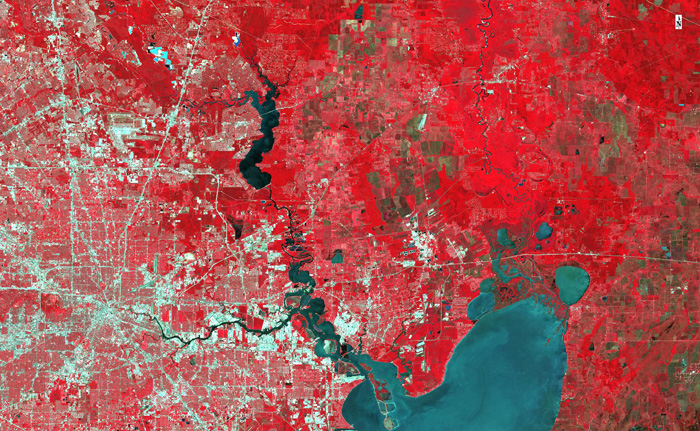
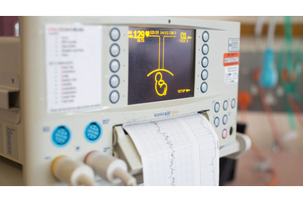
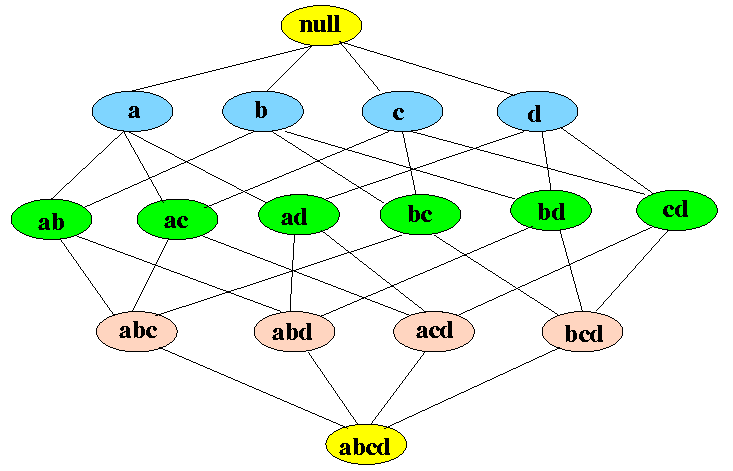
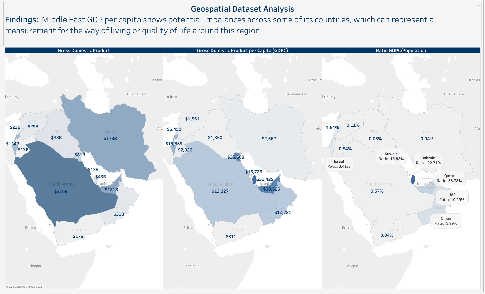
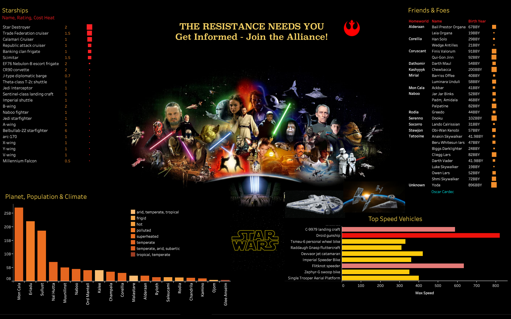

```{r setup, include=FALSE}
knitr::opts_chunk$set(echo = TRUE)
```
[MIT License Copyright (c) 2023 Cardec Solutions](mit_license.html) 

<br/><br/><br/><br/>

#### Fall 2021

---

<p align="right">
  <a href="../reports/ClassificationACFTLateralDeviation.pdf">
  
  </a>
</p>
- [Classification of Aircraft's Lateral Deviation; Caret Models Comparison](../reports/ClassificationACFTLateralDeviation.pdf)&emsp;

<br/><br/><br/>

---

<p align="right">
  <a href="../reports/UnsupervisedLearningKmeans.pdf">
  
  </a>
</p>
- [Landsat Multispectral Scanner Image's Classification with Kmeans Clustering](../reports/UnsupervisedLearningKmeans.pdf)&emsp;

<br/><br/><br/><br/>

#### Spring 2021

---

<p align="right">
  <a href="../reports/NeuralNetworksR.pdf">
  
  </a>
</p>
- [Breast Cancer Dataset Classification with R NeuralNet](../reports/NeuralNetworksR.pdf)&emsp;

<br/><br/><br/>

---  

<p align="right">
  <a href="../ctree/ctree.html">
  
  </a>
</p>
- [Cardiotocograms Interpretation and Classification with R CTREE](../ctree/ctree.html)&emsp;

<br/><br/><br/><br/>

#### Fall 2020

---

<p align="right">
  <a href="../reports/LogisticRegression.pdf">
  
  </a>
</p>

- [Logistic Regresion and Default of Credit Card Payments](../reports/LogisticRegression.pdf)&emsp;

<br/><br/><br/>

---  

<p align="right">
  <a href="../reports/MultipleLinearRegression.pdf">
  
  </a>
</p>

- [Vehicles Valuation with Multilinear Regression](../reports/MultipleLinearRegression.pdf)&emsp;

<br/><br/><br/><br/>

#### Summer 2020

---

<p align="right">
  <a href="../reports/AssociationApriori.pdf">
  
  </a>
</p>

- [Association Rules for Credit Approvals with R Apriori](../reports/AssociationApriori.pdf)&emsp;

<br/><br/><br/><br/>

----

<p align="right">
  <a href="../text_analysis/README.html">
  
  </a>
</p>

- [NSS Text Analysis with NLTK; Visualized in Tableau](../text_analysis/README.html)&emsp;

<br/><br/><br/>

#### Spring 2020

---

<p align="right">
  <a href="../html/time_series.html">
  
  </a>
</p>

- [Infographic: Apple Stock Market](../html/time_series.html)&emsp;

<br/><br/><br/>

---

<p align="right">
  <a href="../infographic/geospatial_analysis.png">
  
  </a>
</p>

- [Infographic: Middle East GDP](../infographic/geospatial_analysis.png)&emsp;

<br/><br/><br/><br/>

---

<p align="right">
  <a href="../infographic/jointhealliance.png">
  
  </a>
</p>

- [Infographic: Join the Alliance](../infographic/jointhealliance.png)&emsp;

<br/><br/><br/><br/><br/><br/> 

---  

[Home Page](../index.html)
